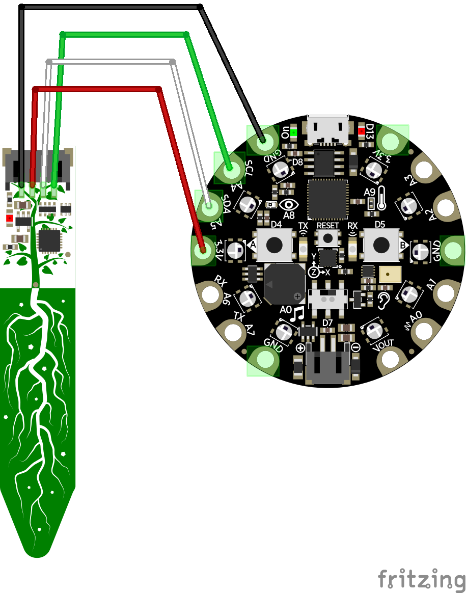
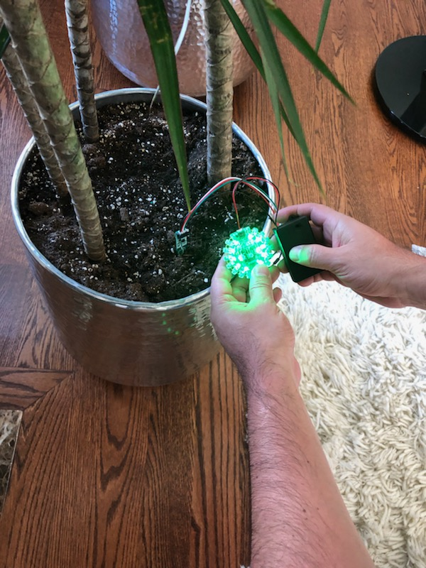

# Soil Moisture Sensor with the Circuit Playground Express board

This is a simple soil sensor setup using the Adafruit Circuit Playground Express board and 
the Adafruit STEMMA Soil Sensor. The code is written in Circuit Python.

## Parts
* [Adafruit Circuit Plaground Express](https://www.adafruit.com/product/3333)
* [Adafruit STEMMA Soil Sensor - I2C Capacitive Moisture Sensor](https://www.adafruit.com/product/4026)
* [Adafruit Circuit Playground Express Enclosure](https://www.adafruit.com/product/3915)
* [JST PH 3-Pin to Female Socket Cable - 200mm](https://www.adafruit.com/product/3894)
* [3 x AAA Battery Holder with On/Off Switch and 2-Pin JST](https://www.adafruit.com/product/727)

## Wiring

## Soil Moisture Sensor in Action 
